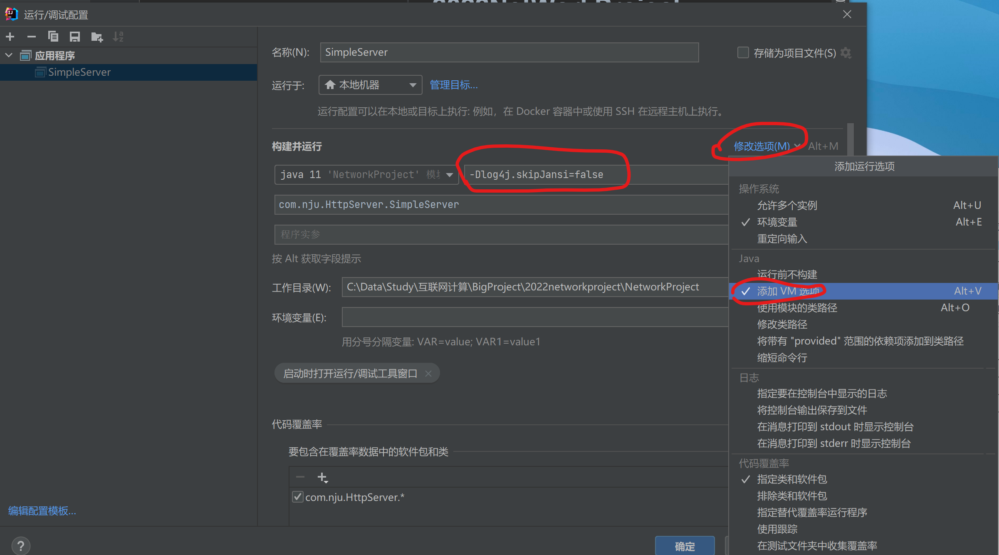

## Http-Server

### Before Start

本项目使用了`log4j2`记录日志，为保证控制台日志信息**有颜色**，请先设置JVM参数：`-Dlog4j.skipJansi=false`

运行后，打开http://localhost:5000/index.html ,出现一个带图片的注册登录页面，说明项目配置正常。

本项目请求处理逻辑均借鉴（ChaoXi）了tfgg的代码，在Socket IO部分将BIO（同步阻塞）改为了AIO（异步非阻塞），为了体现创新（BiMianChaChong）。

然而，这样的改动却带来了一些（JuDa）挑战。需要深入了解Java AIO才能继续进行工作。

简单介绍：NIO是一个请求一个线程。AIO是一个有效请求一个线程。AIO的特性是**回调函数**`completed`和`fail`，在IO完成后，系统根据IO成功与否自动调用，进行数据处理。

参考：

- https://blog.csdn.net/weixin_34501666/article/details/113046861
- https://blog.csdn.net/f76756154/article/details/84537583
- https://blog.csdn.net/m0_64383449/article/details/122102570
- http://www.wjhsh.net/Theshy-p-7696313.html

项目简介：SimpleServer类负责启动主线程ServerHandler以监听请求。监听到连接请求，回调AcceptHandler，AcceptHandler回调RequestHandler处理Http信息。
Http包负责封装请求和响应。Controller包负责处理具体指令（如GET静态资源等），其中RequestMapper是仿Springboot风格的uri匹配器。
Router包是uri匹配器的具体实现。Common包存放静态配置。public文件夹下放了一个演示网页。

### Todo:

- **已修复2022.4.17**：修复`keep-alive`问题（包括定时断开连接的实现，发送close connection请求的实现），主要在`RequestHandler`和`AcceptHandler`类中修改。*
  问题复现：多次硬刷新页面，可以看到IOException，猜测可能是连接断开时机的问题。*
- **已实现2022.4.18**：实现类Spring Controller模式的URL Mapper
- **feat**:把Controller.Executors精简一下
- **feat**:测试
- **feat**:装潢状态码页，演示网站，搞一下门面工程
- **feat**:期望的目标：能把软工2的网站放上去（想想就好）